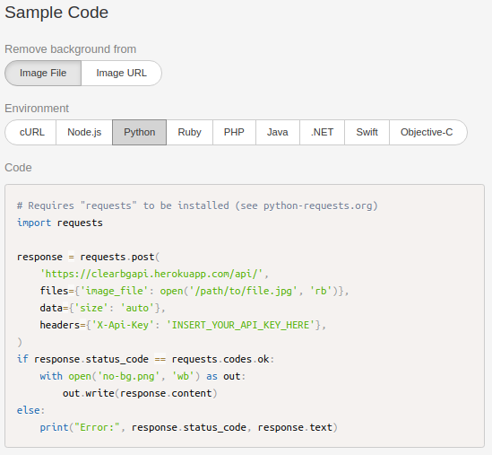
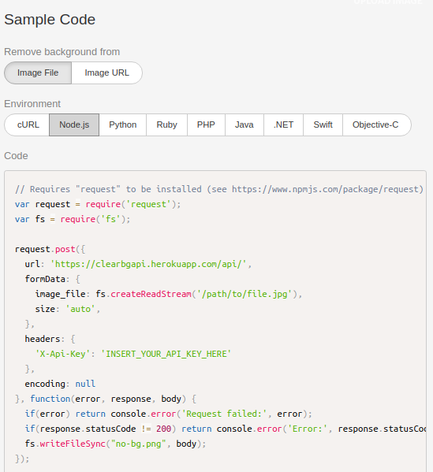
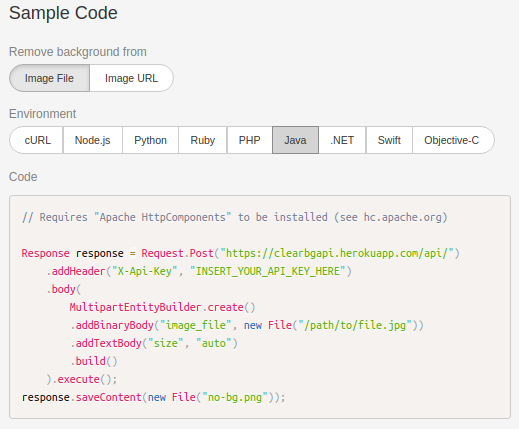
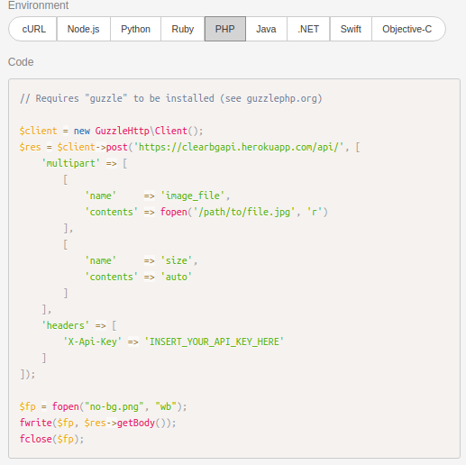

<h1> ClearBgApi</h1>

<h1>Objetivo</h1>

    Criar uma Api fazendo uso de Inteligência Artifícial (utilizando mais especificamente
    o deep learning) que tornasse possível a remoção do fundo de uma imagem

<h1> Plataformas integradas</h1>
<h3>A api está disponível para maioria das linguagens, entre elas:</h3>
<ul>
    <li>Python</li>
    <li>Nodejs</li>
    <li>Java</li>
    <li>Php</li>
</ul>

<h1>Alguns exemplos de implementações</h1>

<h1>Observações</h1>

    Estes e mais exemplos você pode encontrar acessando o website do projeto.

    Para ir para a página do projeto vá para <a href="http://clearbg.orgfree.com/index.html" target="_blank">http://clearbg.orgfree.com/index.html</a>

    Se quiser ir para o git do projeto do website <a href="https://github.com/celsolnv/clearBg" target="_blank">Clique aqui.</a>

